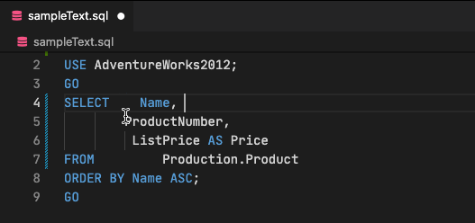
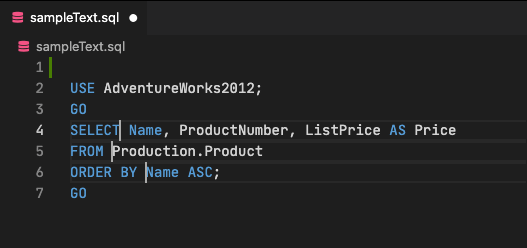

# column-aligner

This extention adds a shortcut key (by default, `Shift-Alt-\` or `Shift-Cmd-\`) that will attempt to align the selected text to the nearest tab stop column to your cursor position.

## What Problem Does This Solve?

In languages like SQL, it is sometimes desirable to align related lines of code with tabs or spaces for readability. Keeping up with this manually can be a chore.

## Features

- Multi-line selection alignment
- Multi-cursor selection alignment (selections don't need to be contiguous)
- Respects your tab width and expansion settings

### Multi-line selection alignment

If you select a range of rows and run this, it will tab-align all selected lines to the nearest tabstop of where your selection started:

Note in the above example that it indents further than needed for readability. After aligning the text, your selection is updated to a multi-cursor at the right of the inserted tabs/spaces, so you can easily adjust the column spacing to taste.

### Multi-cursor selection alignment

If you select more than range using multi-cursor selection, it will align each row to the nearest tab stop of the greated cursor column.

### Tabs or Spaces

I use tabs in every language where it is legal (basically, everything but YAML). Many developers prefer spaces. This extension uses your preferred tab vs. spaces setting and tab width.

It does _not_ right-trim the rows after aligning them, but this was done purposefully, to allow easier follow-up editing. I recommend using `"files.trimTrailingWhitespace": true` in your settings.

## Requirements

None.

## Known Issues

None.

## Bug Reports and Contributions

This is my first Azure Data Studio extension. I'm sure there are edge cases I haven't considered. Please report bugs through GitHub Issues, with minimal reproducible instructions. An animated recording would also be helpful.

Pull requests are welcome! Please follow the code formatting and linter/prettier settings I'm already using.

## Settings

None. You can adjust the keyboard binding in the keyboard bindings, if desired.

## Release Notes

### 1.0.0

Initial release.
